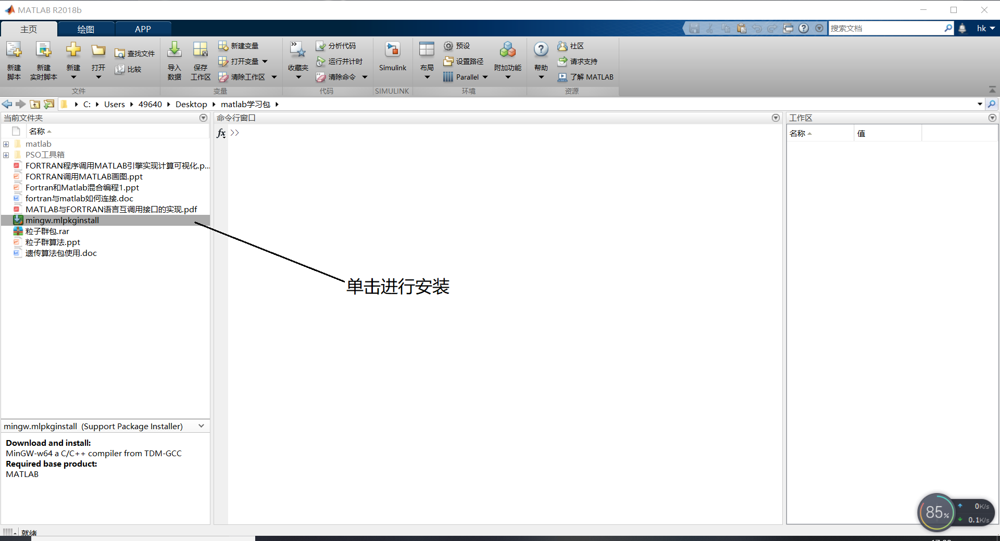
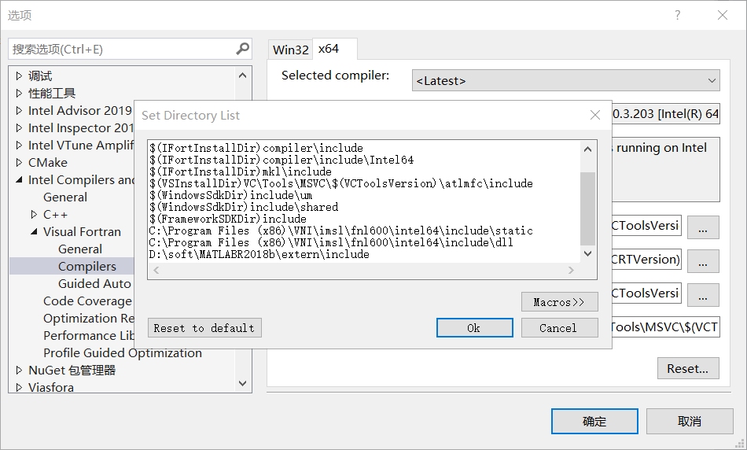
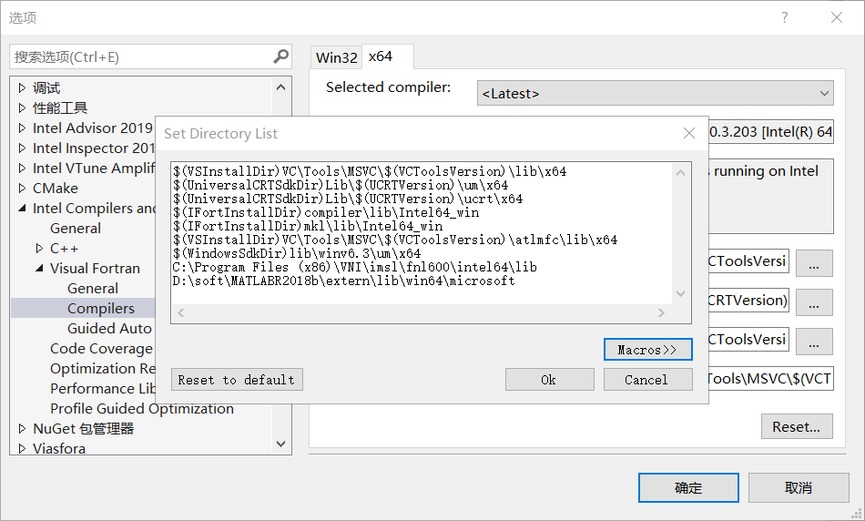

<h2 align=center> 电性源纵向电导成像帮助文档 </h2>

[返回上一级](./)

----

#### 一.实验上的问题说明 ####

- 1.对dBzdt求导，早期存在较小的误差，而晚期2到3道存在较大的误差；

- 2.低阻计算结果不如高阻，因为低阻容易存在饱和现象，当存在饱和现象时，该段的电阻率基本上都是错误的，建议直接截断;

- 3.相同边长的电性源与磁性源在空间上传播速度是一样的！

- 4.原程序中的视深度与接收点的高度有关，而且近似呈斜率为1的线性关系；将`-z/2`修正为`+z/2`，结果几乎不受其影响;

- 5.电流的增大减小对视深度没有大影响，但是，可能会导致牛顿法陷入局部极值或者陷入死循环，此时牛顿法可能得到的结果都不太好，此时可选择使用GA算法或者SA算法；

- 6.当发射源的偏移距增大时，会严重影响到视深度，当偏移距为500m的时候，这种影响尤为严重，是视深度的主要影响因素；
**原因：** 早期饱和值得出现导致起始的视深度计算错误！甚至出现不单调的情况出现，其中在10^(-6)的时间点上5m长的线源未有饱和现象，而50m的有较小的饱和现象，而500m的有非常大的一段为饱和现象！而饱和现象的长短与偏移距有关，偏移距越长，饱和时间段越长。

----

#### 二.程序使用说明 ####

- 1.文件的输入：`OPEN(11,FILE='dBz_t.txt',ACTION='READ')`,该程序默认的输入文件为1个，此时输入的文件名为：**dBz_t.txt**，当然可以根据自己需要在该代码修改文件名；

- 2.文件内参数的输入：
 (1). 第1行是代表发射源各个端点的x,y坐标，如果有n个源，则有4*n个发射源参数，输入顺序：
 ```第1个源左端点的x坐标，第1个源左端点的y坐标，第1个源右端点的x坐标，第1个源右端点的y坐标，第2个源左端点的x坐标...```
 (2). 第2行为电流的大小，输入顺序为：
 ```第1个源电流大小，第2个源电流大小...```
 (3). 第3-n行为测点的x,y,z的坐标，如果有n个测点，则有n个重复(3)中的参数输入顺序(注意，方向向下为正，所以地空中测点的z总为负)，输入顺序为为：

 ```txt
 第1个测点的x坐标，第1个测点的y坐标，第1个测点的z坐标
 第1个测点的时间道，第一个测点的dBz/dt的响应
 ... ...
 ... ...
 第2个测点的x坐标，第2个测点的y坐标，第2个测点的z坐标
 ... ...
 ... ...
  ```

- 3.程序内参数的修改：除了文件内参数的设置外，还需要对程序内的参数进行设置，`INTEGER,PARAMETER::nt=41,mn=1,n=1,nlayer=60,num=1`，主要是对该行的参数进行修改，其中：

```txt
nt为时间的道数
mn是源的个数
n是每个源的剖分段数，n一般设置为1，在该程序中，n的大小对结果几乎无影响
nlayer是计算层数，与前面的计算无关，只是用于后面的插值计算，如果计算深度大，则nlayer要设置比较大，具体大小nlayer=Hmax/TH，TH是每一层的厚度，在此处nlayer我们建议一般不进行修改
num为测点个数
```

- 4.输入文件和参数示例：
- 输入文件内容为：

```txt
-500.00000      50.0000000E+00   500.00000      50.0000000E+00
1
0 0 0
1E-06,-0.003371976
1.258925E-06,-0.003301226
1.584893E-06,-0.003134731
1.995262E-06,-0.002843394
2.511886E-06,-0.002439166
3.162278E-06,-0.00197183
3.981072E-06,-0.001504911
5.011872E-06,-0.001090052
6.309574E-06,-0.000754412
7.943282E-06,-0.0005023187
1E-05,-0.0003238491
```

- 输入参数为：

```Fortran
INTEGER,PARAMETER::nt=11,mn=1,n=1,nlayer=60,num=1
```

----

#### 三.程序注意事项 ####

- 1.一般而言，该方法里面自带的`Newton`方法是能够计算出结果的，并且精度能达到使用要求，只有当无法计算的时候才建议使用`SA_method`和`GA_method`，其中`GA_method`调用了matlab的库中粒子群算法，如果没有matlab2018b或者以上的版本是无法调用的，如果你嫌麻烦，可以使用`SA_method`，该方法为Fortran编写的简单的模拟退火法，但需要根据情况调整区间；

- 2.如果不使用`GA_method`，则从工程中删除`GA_method.f90`和`Plot.f90`，并注释或删除`#include "fintrf.h"`；

- 3.如果想使用`GA_method`，则需要准备以下：

(1).你需要安装2018b或者以上的matlab；

(2).打开matlab单击`mingw.mlpkginstall`进行安装，安装完后，在matlab的命令窗口输入`mex -setup`，选择`mex -setup FORTRAN`即可；


(3).设置路径和环境：右键单击`我的电脑`，单击`属性`，选择`高级系统设置`，选择`环境变量`,单击下面的`系统变量`中的`Path`，添加matlab的安装路径，如本人的路径为`D:\soft\MATLABR2018b\bin\win64`，设置完后，重启电脑才能生效。
重启完后，环境就设置好了，接下来需要设置VS的默认搜索路径，打开VS，选择`工具`中的`选项`，单击`Intel Conpilers and Tools`中的`Visual Fortran`，单击`Compilers`，注意选择`X64`(因为安装的matlab是64位的)，在`Includes`中添加`D:\soft\MATLABR2018b\extern\include`，在`Libraries`中添加`D:\soft\MATLABR2018b\extern\lib\win64\microsoft`，以上操作完成后，则默认搜索路径设置就完成了。



(4).设置预编译和添加静态库：首先单击`项目`中的`属性`，打开`Fortran`中的`Preprocessor`，将`Preprocessor Source File`设置为`Yes`，
预编译的设置完成；然后打开`Linker`中的`Input`，在`Additonal Dependencies`中添加`libmx.lib libeng.lib libmat.lib libmex.lib`，即完成所有工作(注意一定要用64位的进行编译)。

- 4.建议正演的时候尽量使用高阻小偏移距，这样算的结果才比较优秀。其中输出文件有2个，`dds.dat`是用来区分界面的，`ps.dat`是视电阻率定义，一般只使用`dds.dat`。
