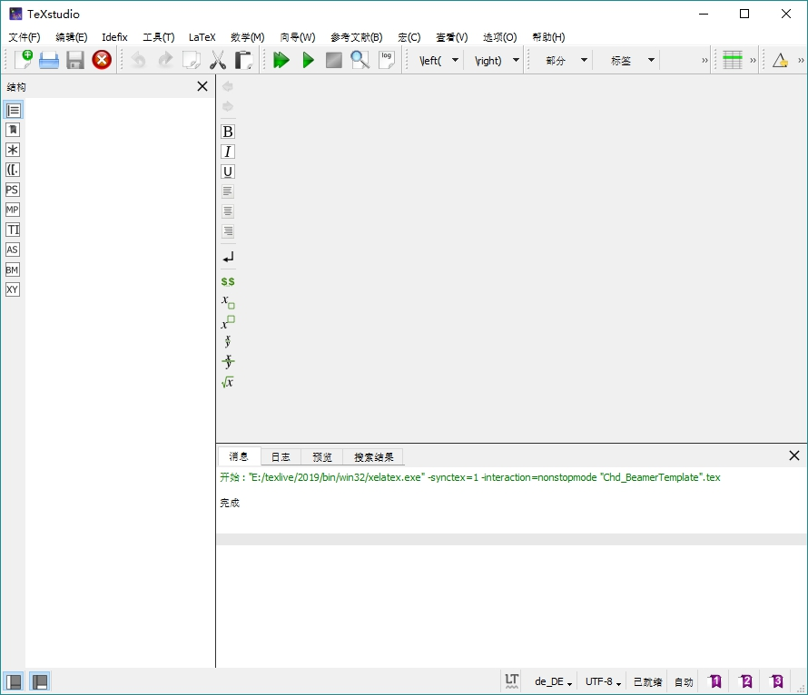
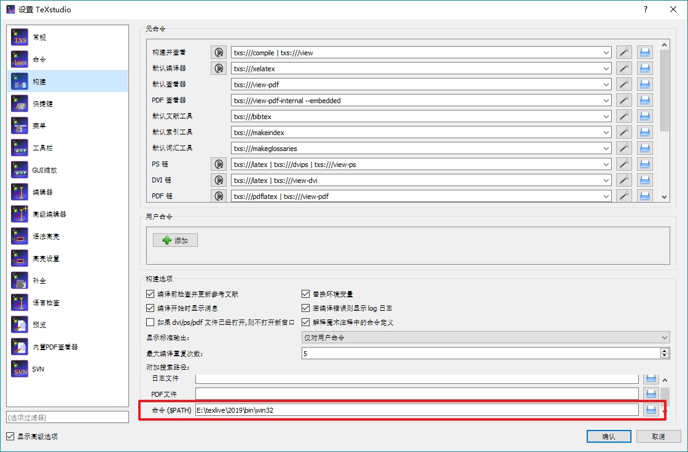
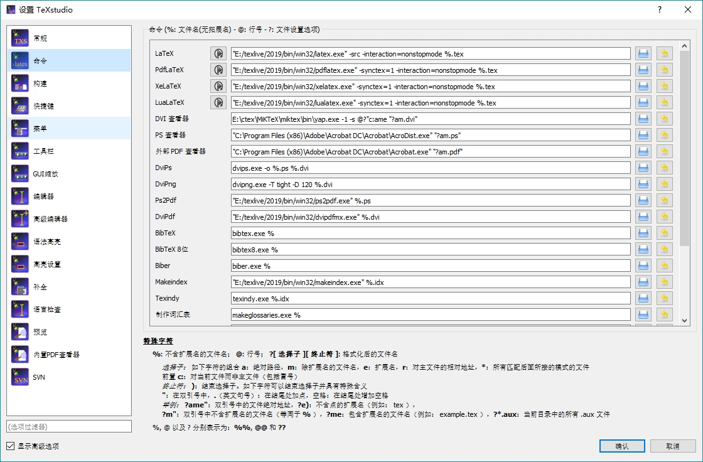
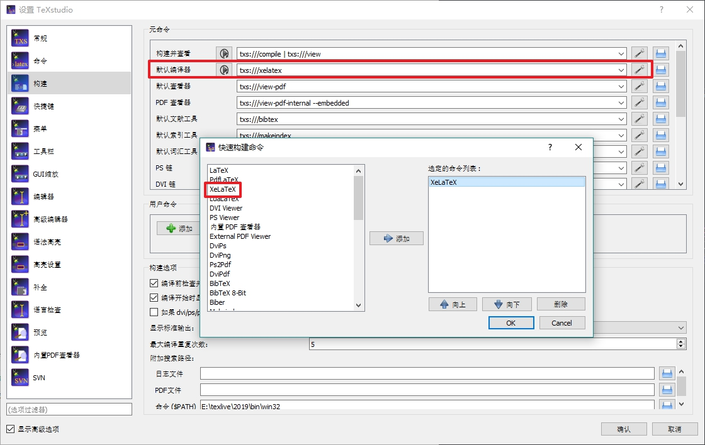

## Beamer模板使用教程
***
[<==](https://github.com/tdem-lixiu/TDEM_Document/blob/master/Summarize/Jingx/README.md) ========================================================================== [==>](https://github.com/tdem-lixiu/TDEM_Document/blob/master/README.md)

### 几个基本概念
- **Beamer**是一个用于创建演示文稿**LaTeX**的文档类。它同时支持``LaTeX + dvips``、``pdfLaTeX``、``LuaLaTeX``以及``XeLaTeX``。它的名称取自德语词汇 Beamer（pseudo-anglicism），意思是影像演示。[Link](https://zh.wikipedia.org/wiki/Beamer_(LaTeX))
- **LaTeX**``（/ˈlɑːtɛx/，常被读作/ˈlɑːtɛk/或/ˈleɪtɛk/）``，排版时通常使用LATEX，是一种基于TeX的排版系统，由美国计算机科学家莱斯利·兰伯特在20世纪80年代初期开发，利用这种格式系统的处理，即使用户没有排版和程序设计的知识也可以充分发挥由TeX所提供的强大功能，不必一一亲自去设计或校对，能在几天，甚至几小时内生成很多具有书籍质量的印刷品。对于生成复杂表格和数学公式，这一点表现得尤为突出。因此它非常适用于生成高印刷质量的科技和数学、物理文档。这个系统同样适用于生成从简单的信件到完整书籍的所有其他种类的文档。[Link](https://zh.wikipedia.org/wiki/LaTeX)

### 环境配置

#### Tex Live
这部分内容引用知乎文章[TeX Live 环境的安装与配置](https://zhuanlan.zhihu.com/p/41855480)

##### 关于TeX Live
TeX Live 是 TUG (TeX User Group) 发布并维护的的 TeX 系统，可以称得上是TeX的官方系统。对于任何阶段的TeX用户，都可以使用TeX Live， 以保持在跨操作系统、跨用户的TeX文件一致性。本文主要阐述如何安装TeX Live环境，以当下最新版本的TeXLive 2018 为例，并详细介绍在Win 10环境下的安装和配置。

##### TeX Live下载
首先，我们进入TeX Live 的[官方站点](https://www.tug.org/texlive/)。

这里，通常有两种下载方式，一是直接联网下载，通过点击官网首页页面上的``download``链接获取window的下载文件或者Linix的下载文件，双击之后就能看到一个批窗口，尽情享受下载的过程了。不过，下载过程中需要一直联网，而且持续的时间会比较久。

第二种方式是通过直接下载ISO镜像，点击官网首页页面上的``on DVD``链接获取。


如果下载很慢，可以尝试下清华大学和中国科技大学的镜像。

##### TeX Live的安装
在打开镜像后，能看到大礼包大概是这样


为了避免用户权限问题，可以用管理员模式（右键-->Run as Administrator）运行``install-tl-advanced.bat``文件。然后就能见到安装界面，默认安装即可。安装完成后检查环境变量是否添加成功。

##### 安装版本确认
在安装完之后，可以调用``commond``，分别输入

```bash
>> tex -v
>> latex -v
>> xelatex -v
>> pdflatex -v
```

来获取安装的TeX的环境信息！如果看到的版本信息能够正常输出，那么TeX Live的安装就是成功的！

#### TeXstudio

##### 关于TeXstudio
**TeXstudio**是一款开源的跨平台LaTeX编辑软件，用户界面与Texmaker类似。作为LaTex的集成开发环境，TeXstudio为用户提供了交互式拼写检查、代码折叠、语法高亮等特性但并没有集成编译LaTeX文件的功能，用户需自行安装LaTeX编译软件。该软件是开始自Texmaker的一个分支，起初叫做TexMakerX，它在添加了额外的特点的同时维持了与Texmaker相同的观感。TeXstudio能在``Windows``、``Unix``、``BSD``、``Linux``以及``Mac OS``上运行。

##### TeXstudio下载
进入TeXstudio的[官方网站](http://texstudio.sourceforge.net/)下载合适的版本安装，界面如下：


##### TeXstudio设置
在TeXstudio主界面菜单栏点击``选项-->设置TeXstudio``进入设置界面，主要检查``$PATH``是否设置为Tex Live的路径以及构建命令可执行文件的路径，可以参考下面的设置：



### 编译Beamer模板

#### Beamer模板文件
参考开源项目：华中师范大学幻灯片模板[CCNU_BeamerTemplate](https://github.com/K-JW/CCNU_BeamerTemplate)
使用其模板并替换Logo及图片位置参数，所有文件可在我的项目文件夹中下载（[链接](https://github.com/jingxu94/jx_code/tree/master/slide)）。其中``ccnu.sty``文件即为模板文件，可在该文件中修改配色或模板图片参数。

#### 编译Beamer模板文件
制作PPT时仅需在TeXstudio中打开``Chd_BeamerTemplate.tex``文件进行改写，其中内容我已进行简单说明，包括封面信息、标题、分栏、图片和列表均作出了示例，按照自己的需求更改其内容即可。改写完成后点击工具栏绿色三角按键即可进行构建，``Chd_BeamerTemplate.pdf``为编译后的文件。

**需注意**:编译该文件需设置使用``XeLatex``进行编译，具体设置参考下图：


示例文件内容如下：

```Latex
\documentclass[10pt,aspectratio=169,mathserif]{beamer}		
%设置为 Beamer 文档类型，设置字体为 10pt，长宽比为16:9，数学字体为 serif 风格

%%%%-----导入宏包-----%%%%
\usepackage{ccnu}			%导入 CCNU 模板宏包
%\usepackage{ctex}			 %导入 ctex 宏包，添加中文支持
\usepackage{xeCJK}
\usepackage{amsmath,amsfonts,amssymb,bm}   %导入数学公式所需宏包
\usepackage{color}			 %字体颜色支持
\usepackage{graphicx,hyperref,url}	
%%%%%%%%%%%%%%%%%%


\setsansfont{Helvetica} 							%Windows和Mac OS下都可用
%\setsansfont{Times New Roman}
%\setCJKmainfont{Hiragino Sans GB W3}    	%仅Windows可用
\setCJKmainfont{Songti SC}								%仅Mac OS下可用

% \beamertemplateballitem		%设置 Beamer 主题
\usetheme{Copenhagen}
\usecolortheme{orchid}


\AtBeginSection[]
{
  \begin{frame}<beamer>
    \frametitle{\textbf{目录}}
    \textbf{\tableofcontents[currentsection]}
  \end{frame}
}


%%%%----首页信息设置----%%%%
\title[Full-domain Apparent Resistivity Definition with Arbitrary Transmitting Waveform]{\fontsize{13pt}{18pt}\selectfont {Full-domain Apparent Resistivity Definition for Loop Source TEM with Arbitrary Transmitting Waveform}}
%\subtitle{\fontsize{9pt}{14pt}\selectfont \textbf{子标题}}			
%%%%----标题设置


\author[Xu Jing]{Xu Jing \\ \texttt{jx\_tdem@qq.com}}
%%%%----个人信息设置

\institute[Group TDEM of Prof. Xiu Li]{
  College of Geology Engineering and Geomatics\\
  Chang’an University}
%%%%----机构信息

\date[\today]{
 \today}
%%%%----日期信息

%=====================================================
\begin{document}

\begin{frame}
\titlepage
\end{frame}				%生成标题页
%=====================================================


\section*{目录}

	\begin{frame}
		\frametitle{\textbf{目录}}
		\textbf{\tableofcontents}
	\end{frame}
%=====================================================


\section{引言}

	\begin{frame}
		\frametitle{\textbf{引言}}
		\begin{block}{\textbf{研究背景}}
			\begin{itemize}
				\item 研究背景一
				\item 研究背景二
				\item 研究背景三
			\end{itemize}
		\end{block}
		
		\begin{block}{\textbf{研究现状}}
			\begin{itemize}
				\item 研究现状一
				\item 研究现状二
				\item 研究现状三
			\end{itemize}
		\end{block}
	\end{frame}
%=====================================================


\section[标题简写]{标题的完整表达}

	\begin{frame}
		\frametitle{\textbf{二级标题1}}
		\begin{figure}[!t]
			\centering
			\includegraphics[width=1in]{figures/B_logo.jpg}
			\caption{长大蓝色Logo-这里填图名}
			\label{figure1}
		\end{figure}
		\textbf{粗体文字}普通文字。\\
		换行书写。
	\end{frame}
	
	\begin{frame}
		\frametitle{\textbf{二级标题2}}
		\begin{figure}[!t]
			\centering
			\includegraphics[width=4in]{figures/D_logo.jpg}
			\caption{长大黑色文字Logo-这里填图名}
			\label{figure2}
		\end{figure}
		\textbf{粗体文字}普通文字。\\
		换行书写。
	\end{frame}
	
	\begin{frame}
		\frametitle{\textbf{二级标题3}}
		\begin{figure}[!t]
			\centering
			\includegraphics[width=1in]{figures/B_logo.jpg}
			\caption{长大蓝色Logo-这里填图名}
			\label{figure3}
		\end{figure}
		\textbf{粗体文字}普通文字。\\
		换行书写。
	\end{frame}
%=====================================================
\section[标题三]{标题三的完整表达}

	\begin{frame}
		\frametitle{\textbf{标题3.1}}
		% ----------------分栏的结构开始---------------- %
		% 该结构中使用block分开两个内容区
		\begin{columns}
			\column{.5\textwidth}%分栏占总宽一半
			\footnotesize
			\begin{itemize}
				\item 第一点
				\item 第二点
				\item 第三点
			\end{itemize}
			
			\column{.5\textwidth}%分栏占总宽一半
			\begin{table}%数据表
				\caption{表名}
				\label{table1}
				\centering
				\footnotesize
				\begin{tabular}{|c|c|}%数据表分两列
					\hline
					\textbf{表头栏1}           & \textbf{表头栏2}\\
					\hline
					内容1    				   &1\\
					\hline
					内容2                      &数据2\\
					\hline
					内容3                      &3\\
					\hline
					内容4                      &4\\
					\hline
					内容5                      &5\\
					\hline
					内容6                      &6\\
					\hline
				\end{tabular}
			\end{table}
		\end{columns}
		
	\end{frame}

	\begin{frame}
		\frametitle{\textbf{标题3.2}}
		\begin{figure}[!t]
			\centering
			\includegraphics[width=4in]{figures/D_logo.jpg}
			\caption{长大黑色文字Logo-这里填图名}
			\label{figure4}
		\end{figure}
		\textbf{粗体文字}普通文字。\\
		换行书写。
	\end{frame}

\end{document} 
```