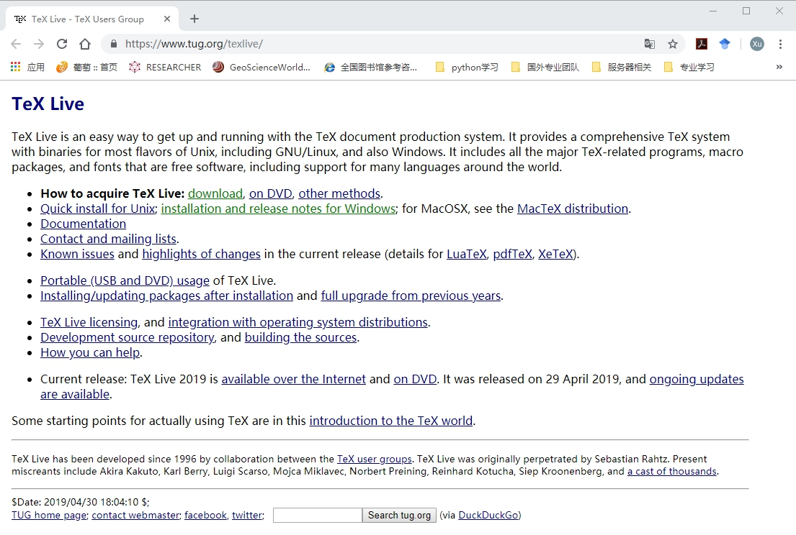
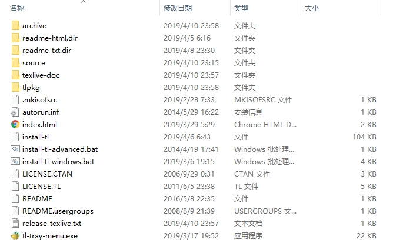

## Beamer模板使用教程
***
[<==](https://github.com/tdem-lixiu/TDEM_Document/blob/master/Summarize/Jingx/README.md) ========================================================================== [==>](https://github.com/tdem-lixiu/TDEM_Document/blob/master/README.md)

### 几个基本概念
- **Beamer**是一个用于创建演示文稿**LaTeX**的文档类。它同时支持``LaTeX + dvips``、``pdfLaTeX``、``LuaLaTeX``以及``XeLaTeX``。它的名称取自德语词汇 Beamer（pseudo-anglicism），意思是影像演示。[Link](https://zh.wikipedia.org/wiki/Beamer_(LaTeX))
- **LaTeX**``（/ˈlɑːtɛx/，常被读作/ˈlɑːtɛk/或/ˈleɪtɛk/）``，排版时通常使用LATEX，是一种基于TeX的排版系统，由美国计算机科学家莱斯利·兰伯特在20世纪80年代初期开发，利用这种格式系统的处理，即使用户没有排版和程序设计的知识也可以充分发挥由TeX所提供的强大功能，不必一一亲自去设计或校对，能在几天，甚至几小时内生成很多具有书籍质量的印刷品。对于生成复杂表格和数学公式，这一点表现得尤为突出。因此它非常适用于生成高印刷质量的科技和数学、物理文档。这个系统同样适用于生成从简单的信件到完整书籍的所有其他种类的文档。[Link](https://zh.wikipedia.org/wiki/LaTeX)

### 环境配置

#### Tex Live

##### 关于TeX Live
TeX Live 是 TUG (TeX User Group) 发布并维护的的 TeX 系统，可以称得上是TeX的官方系统。对于任何阶段的TeX用户，都可以使用TeX Live， 以保持在跨操作系统、跨用户的TeX文件一致性。本文主要阐述如何安装TeX Live环境，以当下最新版本的TeXLive 2018 为例，并详细介绍在Win 10环境下的安装和配置。

##### TeX Live下载
首先，我们进入TeX Live 的[官方站点](https://www.tug.org/texlive/)。

这里，通常有两种下载方式，一是直接联网下载，通过点击官网首页页面上的``download``链接获取window的下载文件或者Linix的下载文件，双击之后就能看到一个批窗口，尽情享受下载的过程了。不过，下载过程中需要一直联网，而且持续的时间会比较久。

第二种方式是通过直接下载ISO镜像，点击官网首页页面上的``on DVD``链接获取。



如果下载很慢，可以尝试下清华大学和中国科技大学的镜像。

##### TeX Live的安装
在打开镜像后，能看到大礼包大概是这样


为了避免用户权限问题，可以用管理员模式（右键-->Run as Administrator）运行``install-tl-advanced.bat``文件。然后就能见到安装界面，默认安装即可。安装完成后检查环境变量是否添加成功。

##### 安装版本确认
在安装完之后，可以调用commond，分别输入

```bash
>> tex -v
>> latex -v
>> xelatex -v
>> pdflatex -v
```

来获取安装的TeX的环境信息！如果看到的版本信息能够正常输出，那么TeX Live的安装就是成功的！