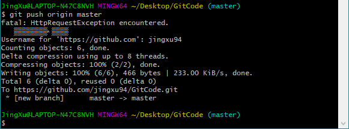
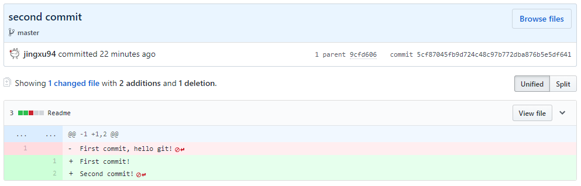

Git使用说明
==================
****
[<==](https://github.com/tdem-lixiu/TDEM_Document/blob/master/Summarize/Jingx/README.md) 

Git工具
-------

### Git是什么

Git是一种分布式版本控制系统 （英语：`distributed revision control 或 distributed version control` ），又称去中心化版本控制（decentralized version
control），最初由Linux内核最早作者Linus Torvalds创作，它是一种版本控制的方式，它允许软件开发者可以共同参与一个软件开发专案，但是不必在相同的网络系统下工作。
简单理解为：Git是版本控制器，它可以记录你代码各版本之间的变化，不需要进行文件的复制备份存档。

### Git安装

Git官方网站 [`https://git-scm.com/`](https://git-scm.com/) ，选择合适的版本下载安装，目前最新版本为Version 2.21.0 (Release Notes (2019-02-24))。


### Git的使用

#### 0. 前期准备

注册一个Github账号，网址 [`https://github.com/`](https://github.com/)


#### 1. 创建Workspace

新建文件夹``GitCode``，将它设定为我们的workspace，我们需要Git控制的代码以后全部在这个目录下，当然，在GitCode文件夹下创建若干子文件夹也是可以的。

#### 2. 创建Repository

Repository可以称为版本库，你可以简单的理解一个目录，这个目录里面的所有文件都可以被Git管理起来，每个文件的修改，删除，Git都能跟踪，以便任何时刻都可以追踪历史，或者在将来某个时刻还可以将文件“还原”。我们打开刚才新建的GitCode文件夹，在右键菜单中选择``Git Bash here``


在命令行中输入：

```bash
>> git init
```

意为：将这个目录**初始化为Git版本库**。这样，我们就创建好了Repository


#### 3. 创建Remote

我们的远程仓库Remote可以通过GitHub提供，登陆GitHub网站，右上角点击头像后点击``Your profile``：


 
出来的界面就是你的主页，可以看到你的远程仓库以及活跃度等信息。这里我们新建一个远程仓库，点击右上角加号，在出来的菜单选择``New repository``：


 
创建一个和之前本地仓库名字相同的远程仓库``GitCode``，可以选择自己的远程仓库是公开可见还是仅自己可见，这个视自己情况选择。


 
这样，我们就成功创建了远程仓库。


 
可以退回到自己的主页中，在Repository中可以查看自己已经创建的远程仓库。


#### 4. Commit操作（本地仓库提交）

我们进入本地创建好的版本库GitCode中，在这里新建一个Readme文件：


编辑其中的内容，并保存


假定现在的文件就是我们版本管理的第一版，此时的文件是保存在当前工作区的，也就是Workspace，我们要将这个状态提交至Repository进行版本管理，
这就需要``Commit``命令。在GitCode目录下右键菜单中点击``Git Bash here``，输入命令：

```bash
>> git add --all
>> git commit -m 'first commit' -a
```

其中add命令将更改加入到暂存区Index，commit命令将更改提交至版本库Repository。我们可以log命令查看提交记录：

```bash
>> git log
```


我们修改Readme中的内容，删除了hello git，增加了第二行内容，与之前操作相同，进行第二次提交：


这样，我们就学会了本地版本库的提交命令，版本库会记录我们每次提交的修改。

#### 5. 远程仓库同步

我们要将本地版本库和远程仓库之间建立起关系，这样，我们的版本库可以在云端有一个备份，也可以更方便地管理和交流我们地代码。在GitCode目录下右键菜单中点击Git
Bash here，输入命令：

```bash
>> git remote add origin https://github.com/jingxu94/GitCode.git
```

add后面的origin代表远程仓库的名字，一般习惯设定为origin，后面的网址就是3节中在github上创建的远程仓库的地址。这样我们就建立起了本地仓库与远程仓库的联系，
可以用下面的命令来查看二者之间是否建立起了联系：

```bash
>> git remote -v
```


接下来我们将本地版本库里两次提交的信息同步至远程仓库，输入命令：

```bash
>> git push origin master
```

push指令就是将本地版本库推送同步到与之建立起关联的远程仓库中，其中``origin``代表之前设定的远程仓库名称，``master``代表当前的主分支，由于我们没有创建分支操作，所有更改都是建立在主分支上的，可以看到在GitCode后跟有括号里写着``master``。运行后需要输入github账号和密码，按要求输入即可完成。



用网页登陆GitHub，进入GitCode仓库查看，之前本地仓库的内容已经同步到了远程仓库。可以看到这个代码库有``2次提交(commit)``，``1个分支(branch)``，点击查看我们的提交记录，类似``git log``命令。


点击``second commit``查看我们第二次提交的内容，可以看到我们在版本库内的增删改操作。至此，我们就学会了远程仓库的同步和基本查看操作。

```diff
- First commit, hello git!
+ First commit!
+ Second commit!
```



#### 6. 版本回滚

如果在Workspace中进行修改后出现问题，需要上一版本的代码文件，但又因大量的修改已经面目全非，这时我们可以进行版本回滚的操作，可以回退到之前任何一次提交的状态。
首先用``git log``命令或者在远程仓库查看commit历史，可以看到每次提交会对应一个编号：


输入命令：

```bash
>> git reset --hard [编号]
```

即可退回当次提交的状态。或者不用编号，``HEAD``代表最近一次提交，``HEAD\^``代表倒数第二次提交，同理可以使用``HEAD\^n``来退回至n次提交之前的状态。

现在我们GitCode仓库有2次提交，比如我们要回退至第一次提交的状态，可以直接输入命令：

```bash
>> git reset --hard HEAD^
```


此时查看``git log``就没有第二次提交的信息了，如果我们后悔了，想退回更新的版本，可以使用``git reflog``来查看所有操作记录，找到新版提交的编号，再使用git
reset命令即可。


#### 7 其他命令

日常使用掌握以上命令足够管理好自己的代码仓库，至于分支操作，多人协作等功能感兴趣可以自行研究。GitHub是一个很好的开源社区，希望大家都可以好好利用这里的丰富资源，熟练使用git工具，越做越规范，管理好自己的代码仓库。

VS Code
-------

### 前言

本段内容引自 [`https://github.com/qianguyihao/`](https://github.com/qianguyihao/)

**VS Code**本来是前端人员专用，但由于它实在是太好用了，于是，各种开发方向的码农也正在用VS Code 作为他们的主力编程工具。甚至是一些写作的同学，也把 VS Code 作为**markdown**写作工具。

### VS Code 的介绍

VS Code 的全称是 Visual Studio Code，是一款开源的、免费的、跨平台的、高性能的、轻量级的代码编辑器。它在性能、语言支持、开源社区方面，都做的很不错。

### 编辑器 与 IDE

`IDE`和`编辑器`是有区别的：

-   **IDE**
    对代码会有较好的智能提示，同时侧重于工程项目，对项目的开发、调试工作有较好的图像化界面的支持，因此比较笨重。比如 Eclipse 的定位就是 IDE。
-   **编辑器**：要相对轻量许多，侧重于文本的编辑。比如 Sublime Text 的定位就是编辑器。再比如 Windows系统自带的「记事本」就是最简单的编辑器。

需要注意的是，VS Code 的定位是`编辑器`，而非`IDE`。但 VS Code 又比一般的编辑器的功能要丰富许多。

### VS Code的一些补充

-   VS Code 的使命，是让开发者在编辑器里拥有 IDE 那样的开发体验，比如代码的智能提示、语法检查、图形化的调试工具、插件扩展、版本管理等。
-   VS Code 的源代码以MIT协议开源。

### VS Code 的安装

-   VS Code 官网：<https://code.visualstudio.com>

VS Code 的安装很简单，直接去官网下载安装包，然后双击安装即可。


上图中，直接点击 download 下载安装即可。
