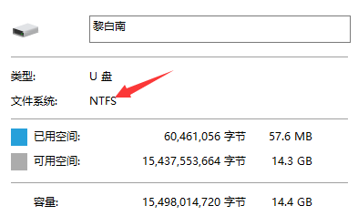
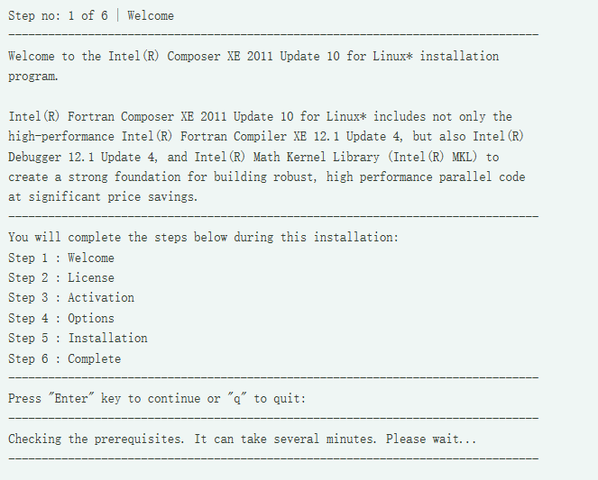
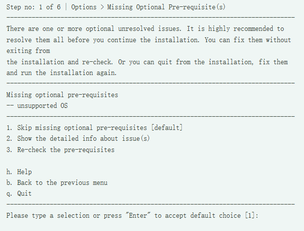
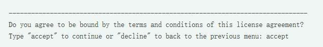
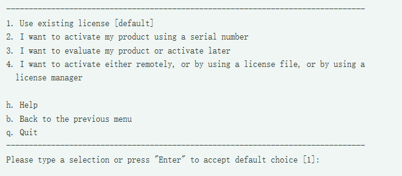
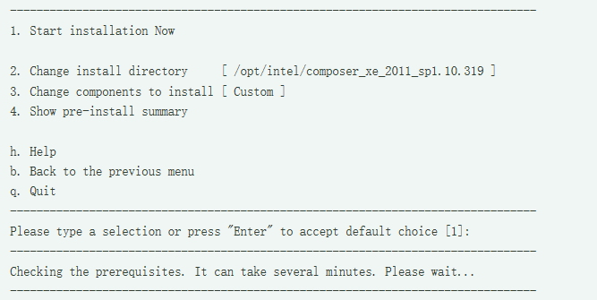

## Centos7上安装ifort2013使用说明-鲁凯亮
****
[<==](https://github.com/tdem-lixiu/TDEM_Document/blob/master/Summarize/Lukl/README.md)

### 1. 下载Intel Fortran


本文先给出linux系统下ifort2013的下载地址，`http://pan.baidu.com/s/1qY30xcg`

### 2. U盘导入

首先要做的工作是确定你的U盘格式，插入U盘，右击，点击“属性”。



可以看到我的U盘为ntfs格式，需要安装ntfs-3g的插件，而且没有yum源，需要下载，比较麻烦。如果你的linux物理机上已经安装了ntfs-3g的插件，那么直接可以进行挂载。如果没有安装ntfs-3g的插件，那么可以把U盘格式转换为fat格式。U盘在fat格式下不需要ntfs-3g插件，可直接挂载。

以下命令我均以root身份执行，若是普通用户，需要sudo+命令，例如`sudo passwd`

FAT格式下的U盘挂载

- 插入U盘，在终端输入命令（严格区分大小写） fdisk
–l（此命令为root用户登陆，如果是普通用户， 需要sudo权限，sudo fdisk
-l，查看分区概况
设备名称为 `/dev/sdb1` ，U盘格式为FAT

- 建立usb挂载点

- 挂载U盘

- 进入U盘并查看
里面有一个许可文件.lic和压缩包.tgz

- 将这许可文件和压缩包拷入另一目录（注意此时你在/mnt/usb下）

- 卸载U盘

- 进入目标目录

至此，准备工作已经做完。

### 3. NTFS格式处理

如果U盘格式是NTFS格式，而且你的linux物理机上安装了ntfs-3g的插件

- 同样地，先查看分区概况

- 挂载U盘

接下里的操作步骤与U盘是FAT格式下的操作相同，不再累赘。

### 4. 安装ifort

#### （1）解压压缩包

为了方便，我将\*.lic文件名修改为ifort2013.lic

#### （2）进入解压后目录

里面有一个install.sh文件，执行下面命令安装

#### （3）安装过程

输入“1”，回车，进去安装阶段。安装过程总共分为7步

第一步：直接回车。接下来系统提示Option\>Missing Optional Pre-requisite(s)，不用理会，输入 `1` ，回车。





第二步：不停按空格键，停下来之后输入 `accept` ，回车



第三步：输入 `1` ，回车。



第四步：输入 `2` ，回车（不参与产品更新体验）

第五步：这里我们采用默认安装，输入 `1` ，回车。（这里应该是 `/opt/intel`，因为我的截图不小心删了，在网上找的一张截图）



第六步：安装完成后，回车

#### （4）新建环境变量

进入安装目录

在最后一行依次输入

```shell
export IFORTHOME=/opt/intel2017
export PATH=/opt/intel2017/bin:$PATH
export LD_LIBRARY_PATH
=/opt/intel2017/compilers_and_libraries_2017/linux/lib/intel64
export LD_LIBRARY_PATH
=$LD_LIBRARY_PATH:/opt/intel2017/mkl/lib/intel64
```

保存修改，并关闭 `.bashrc` 文件

#### （5）使环境变量生效

#### （6）重启电脑

#### （7）重启电脑后输入命令

如果显示版本信息，则安装正确（我的版本为ifort version 17.0.4）。即2017update4。

### 5. 卸载ifort

（1）在安装目录中找到 `uninstall.sh` 文件，执行该文件

（2）如果不小心手残，先将ifort的安装的目录删除了。此时再重新安装ifort，会出现“已经安装该产品”这种错误提示，导致安装程序无法正常进行。这是因为在上一次安装的时候，安装了一大堆rmp文件，并将文件的信息写入了rmp数据库中，而在删除的时候数据库并没有被更新。再次安装的时候，会在数据库中检测到，继而出现“已经安装该产品”的提示错误。解决办法挺简单的，找到所有已安装的intel相关的包，然后删除。

查看uninstall.sh文件，删除其中不以intel开头的包。然后用root权限执行该脚本即可。
（先chmod 777 uninstall.sh，然后./uninstall.sh）

### 郑重声明

- 以上操作均以root身份执行

- 本文是篇参考文章，尤其是对新手来说，在安装过程中会遇到各种各样的问题，请不要认为这篇文章无用。
因为linux操作系统在安装软件时可能需要各种各样的插件，如果你正好缺少哪个插件，则可能会安装失败。

- 经过本人亲测，按照上面的教程安装成功。如有疑问，欢迎拍砖。本人联系方式 QQ：**735343320**
