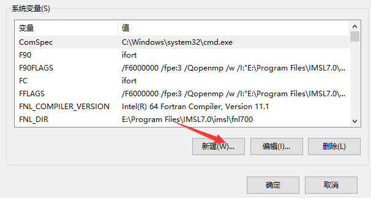
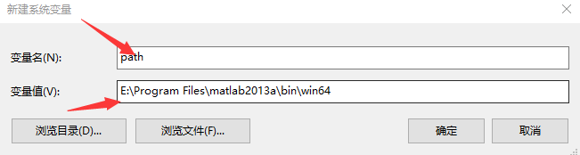
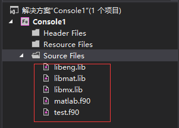
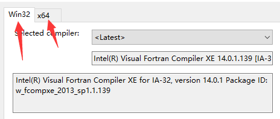
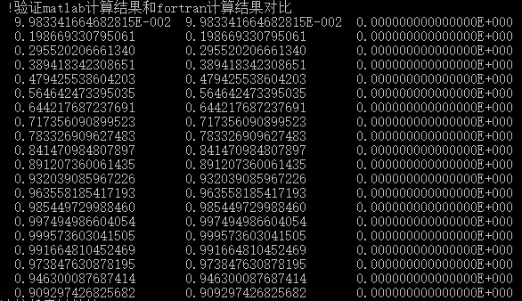
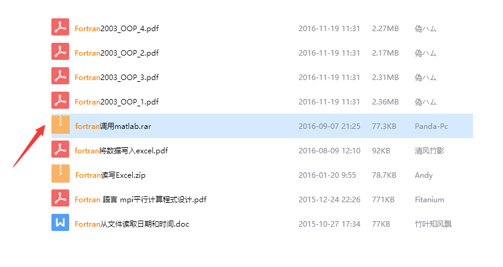

## Fortran与Matlab混编-鲁凯亮
****
[<==](https://github.com/tdem-lixiu/TDEM_Document/blob/master/Summarize/Lukl/README.md)
### 第一章 Fortran编译器与Matlab的安装

#### 1. Fortran编译器和Matlab下载地址

本套教学所用到的Fortran编译器 `Microsoft Visual Studio` + `Intel Visual Fortran（2013）` ，Matlab为2013a版本。

#### 2. Fortran与Matlab混编的必要性

（1）我们都知道Fortran是一门以科学计算位主旨的编程语言，但却不是一款绘图软件，而matlab却弥补了之一短板，通过使用混编，可以在短时间之内作出大量我们需要的图件。

（2）与第三方函数库类似，通过混编，我们可以直接调用matlab中的函数库，比如matlab中的spline函数，这一点我觉得与调用IMSL函数库有点类似。综上两点，我觉得有必要接触学习两者的混编技术（不必深入，会用即可），可以大大提高我们的编程效率和工作效率。

### 第二章 配置环境变量

#### 1. 添加环境变量

我们在环境变量里进行配置。 打开控制面板


选择“大图标”方式显示，点击“系统”。然后点击“高级系统设置”。


然后点击“环境变量”。如下图


在“系统变量”中，点击“新建”。



找到Matlab2013a中 `\bin\win64` 的完整路径，笔者的完整路径为
`E:\Program Files\matlab2013a\bin\win64`

点击“新建”之后，如下图



“变量名”填“path”；“变量值”填Matlab2013a中 `\bin\win64`的完整路径。如上就是我的完整路径。

至此，环境变量设置完毕。重启电脑。重启电脑。重启电脑。

### 第三章 混编程序测试

本文直接给出Fortran调用Matlab的Module（matlab.f90）以及测试程序`test.f90` 。 打开Fortran编译器，添加现有项 `matlab.f90` 和 `test.f90`。然后寻找.lib路径，笔者的.lib路径为`E:\Program Files\matlab2013a\extern\lib\win64\microsoft` 。其中下划线并加粗的路径是绝对的，即matlab装好之后绝对有这个路径，前面的是相对路径，看你自己安装时如何设置安装路径。在此（你的）路径下，找到3个.lib文件添加进来。分别是 `libeng.lib` 、 `libmat.lib` 以及 `libmx.lib`。添加进来后如下图所示。



接下来，一定要确定的是你所安装的matlab是32位还是64位，安装的Fortran编译器是32位还是64位。如果不知道安装的是哪一个，依次点击菜单栏的“工具”》“选项”》“IntelComposer XE”》“Visual Fortran”》“Compilers”，在《关于IMSL7.0的安装以及使用说明》里说过，如下图



我这里显示的是Win32和x64，说明我32位和64位的编译环境都安装了，你那儿显示的是什么就是什么编译环境，本质是一定要使matlab的版本和Fortran的编译环境匹配。（32位的matlab对应32位的Fortran编译环境；64位的matlab对应64位的Fortran编译环境）。怎样设置Fortran的编译环境在《关于IMSL7.0的安装以及使用说明》里说过，不再累赘。我使用的是64位的matlab，自然要使用64位的Fortran编译环境。配置完成之后进行测试，测试结果如下。



最左边是matlab计算结果，右边是Fortran计算结果。计算结果正确，测试成功。最后一点要注意的是由于matlab里数据类型默认为double精度，所以写的子程序全部按照双精度写的。

郑重声明：由于完成时间比较仓促，大家有疑问可以随时联系我。

联系方式：QQ **735343320**

本文在附录后给出源代码。

最后祝大家码到成功!!!

### 附录

#### Test.f90

```Fortran
Program ls
Use matlab
Implicit None

Integer(8),Parameter :: N=5,M=100
Real(8) :: Vx(M),Vy(M),Vy0(M)
Real(8) :: Mat(N,N),MatI(N,N)
Integer :: i,j
Call ranDom_seed()
Do i=1,N
    Do j=1,N
    Call ranDom_number(Mat(i,j))
    End Do
End Do
Print*," !输出Mat在屏幕"
Do i=1,N
    Write(*,"(5f10.5)")(Mat(i,j),j=1,N)
End Do
!//启动matlab
Call startmatlab()
!//将矩阵Mat传输到matlab，并在matlab中也命名为Mat
Call f2mmat(Mat,"Mat",N,N)
!//在matlab中执行求逆，逆矩阵赋值给Mat0
Call mc("Mat0=inv(Mat)")
!//将逆矩阵传输回fortran，赋值给MatI
Call m2fmat(MatI,"Mat0",N,N)
!//输出MatI在屏幕
Print*," !输出MatI在屏幕"
Do i=1,N
    Write(*,"(100f10.5)")(MatI(i,j),j=1,N)
End Do
!//验证是否为逆矩阵
Print*,"!验证是否为逆矩阵"
Mat=Matmul(Mat,MatI);
Do i=1,N
    Write(*,"(100f10.5)")(Mat(i,j),j=1,N)
End Do
!//创建X轴数据
Do i=1,M
    Vx(i)=i*1d0/10d0
    Vy(i)=sin(Vx(i))
End Do
!//将Vx数据传输入matlab
Call f2mvector(Vx,"X",M)
!//对传入的数据求正弦并作图
Call mc("Y=cos(X);plot(X,Y,'-r');hold on;Y=sin(X);plot(X,Y);hold on")!重点重点

!//将求出的正弦返回fortran,赋值给Vy0
Call m2fvector(Vy0,"Y",M)
!//验证matlab计算结果和fortran计算结果对比
Print*,"!验证matlab计算结果和fortran计算结果对比"
Do i=1,20
    Write(*,*)Vy(i),Vy0(i),abs(Vy(i)-Vy0(i))
End Do
End Program ls

2. matlab.f90
module matlab
implicit none

integer(8)::ep  !//指针，用于指向打开的matlab
integer(8)::status  !//记录命令执行结果是否有效

integer(8),external::engopen,engputvariable,enggetvariable,engevalstring,engclose
integer(8),external::MxCreateDoubleMatrix,mxgetpr,MxCreatefull

contains

!//打开matlab程序
subroutine startmatlab()
    implicit none
    write(*,*)"正在打开matlab程序……"
    ep=engopen('matlab')
    if(ep==0)then
    write(*,*)"matlab程序启动失败……"
    stop
    else
    write(*,*)"成功打开matlab窗口……"
    endif
    call mc("clear all")
    call path()      !//将本程序的文件目录设置为matlab使用目录,方便m文件调用
end  subroutine startmatlab

!//关闭matlab引用程序
subroutine closematlab()
    implicit none
    write(*,*)"正在关闭matlab程序……"
    status=engclose(ep)
    if (status/=0)then
    write(*,*)"不能关闭matlab窗口，程序结束"
    else
    write(*,*)"成功关闭matlab程序"
    endif
end subroutine closematlab

!//在matlab中执行命令
!//在matlab里执行字符串里显示的语句/或放在文件目录下的m文件名
subroutine mc(string)
    implicit none
    character(*)::string
    print*,"matlab语句/子程序:  ",string
    if (engevalstring(ep,string).ne.0)then
    write(*,*)"matlab执行fortran命令失败"
    stop
    endif
end  subroutine mc


!//将fortran中矩阵送到matlab中去
!//fdate 数组数据 msting为传入matlab之后数组名 row 矩阵行数 col为矩阵列数
subroutine f2mmat(fdate,mstring,row,col)
    implicit none
    integer(8) row,col
    real(8)::fdate(1:row,1:col)
    character(*)::mstring
    integer(8)::ptemp,fu    !//只能定义为长整形
    !//在matlab里申请内存
    ptemp=MxCreateDoubleMatrix(row,col,0)

    if(ptemp==0)then
    write(*,*)"不能申请到内存"
    stop
    end if
    fu=mxgetpr(ptemp)
    call mxCopyReal8ToPtr(fdate,fu,row*col)
    status=engputvariable(ep,mstring,ptemp)
    call mxDestroyArray(ptemp)
    print*,"正在matlab中生成矩阵:",mstring
    if(status.ne.0)then
    write(*,*)"在matlab中生成矩阵失败"
    stop
    end if
end subroutine f2mmat

!//将matlab的矩阵返回到fortran
!//fdate 数组数据 msting为传入matlab之后数组名 row 矩阵行数 col为矩阵列数
subroutine m2fmat(ddate,mstring,row,col)
    implicit none
    integer*8 row,col
    real(8) ddate(1:row,1:col)
    character(*) mstring
    integer(8) ptemp,fu
    ptemp=enggetvariable(ep,mstring)
    fu=mxgetpr(ptemp)
    call mxCopyPtrToReal8(fu,ddate,row*col)
    write(*,*)"从matlab中返回矩阵：",mstring
end subroutine m2fmat

!//建立matlab路径,方便将matlab的M文件放在fortran目录使用
!//只在matlab启动时被调用
subroutine path()
    character(80)::results
    character(80)::matpath
    integer(8)::pp,getcwd
    pp=getcwd(results)
    matpath="userpath('"//trim(results)// "')"
    pp=engevalstring(ep,matpath)
end subroutine path


!//将fortran的向量传输输入matlab
!//为了方便1维数组传输，在二维数组程序上改写获得
!//vector 传入matlab数组,mstring为传入matlab之后在matlab一维数组名,number元素个数
subroutine f2mvector(vector,mstring,number)
    implicit none
    integer(8) number
    real(8)::fdate(1:number,1),vector(number)
    character(*)::mstring
    integer(8)::ptemp,fu
    fdate(1:number,1)=vector(1:number)
    ptemp=MxCreateDoubleMatrix(number,1,0)

    if(ptemp==0)then
    write(*,*)"不能申请到内存"
    stop
    end if
    fu=mxgetpr(ptemp)
    call mxCopyReal8ToPtr(fdate,fu,number)
    status=engputvariable(ep,mstring,ptemp)
    call mxDestroyArray(ptemp)
    print*,"正在matlab中生成向量:",mstring
    if(status.ne.0)then
    write(*,*)"在matlab中生成向量失败"
    stop
    end if
end subroutine f2mvector

!//将matlab的向量返回到fortran
!//vector 传回matlab数组,mstring为传回数组在matlab之中一维数组名,number元素个数
subroutine m2fvector(vector,mstring,number)
    implicit none
    integer(8) number
    real(8)::ddate(1:number,1),vector(1:number)
    character(*)::mstring
    integer(8)::ptemp,fu
    ptemp=enggetvariable(ep,mstring)
    fu=mxgetpr(ptemp)
    call mxCopyPtrToReal8(fu,ddate,number)
    vector(1:number)=ddate(1:number,1)
    write(*,*)"从matlab中返回向量：",mstring
end subroutine m2fvector


!//fotran里数值参数传递给matlab
!//fortran参数，mstring 传递到matlab里的数值参数名
subroutine f2mnumber(number,mstring)
    implicit none
    real(8)::fdate(1,1),number
    character(*)::mstring
    integer(8)::ptemp,fu
    fdate(1,1)=number
    ptemp=MxCreateDoubleMatrix(1,1,0)

    if(ptemp==0)then
    write(*,*)"不能申请到内存"
    stop
    endif
    fu=mxgetpr(ptemp)
    call mxCopyReal8ToPtr(fdate,fu,1)
    status=engputvariable(ep,mstring,ptemp)
    call mxDestroyArray(ptemp)
    print*,"正在matlab中生成值:",mstring
    if(status.ne.0)then
    write(*,*)"在matlab中生成",mstring,"值失败"
    stop
    end if
endsubroutine f2mnumber

!//将matlab的数值返回到fortran
!//numer,传递回数值参数，msting传回数值在matlab中参数名
subroutine m2fnumber(number,mstring)
    implicit none
    real(8)::ddate(1,1),number
    character(*)::mstring
    integer(8)::ptemp,fu
    ptemp=enggetvariable(ep,mstring)
    fu=mxgetpr(ptemp)
    call mxCopyPtrToReal8(fu,ddate,1)
    number=ddate(1,1)
    write(*,*)"从matlab中返回值：",mstring
end subroutine m2fnumber
end module matlab
```

### 声明

本文主要参考Fortran Coder研讨群中的《Fortran与matlab混编》

