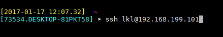
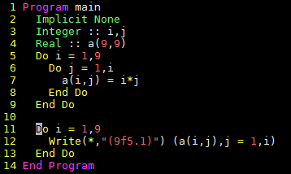
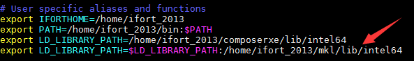

Linux简明教程-鲁凯亮
====================

[<==](https://github.com/tdem-lixiu/TDEM_Document/blob/master/Summarize/Lukl/README.md)

第一章 MobaXterm的安装
----------------------

### 1. 安装MobaXterm Personal Edition

笔者给出下载地址，`http://pan.baidu.com/s/1jHXiD6I`

（1）下载并解压，以管理员身份运行MobeXter-Setup-7.0.msi，进入安装界面。


（2）选择 **next** ，进入下一步。


（3）选择“接受条款”，点击 **next** 。


（4）选择安装路径，本次示范选择默认路径，点击 **next** 。


（5）安装完成，点击 **finish** 。安装完成后，将安装包内的Git.mxt3复制到
`C:\\Program files(x86)\Mobatek\MobaXterm Personal Edition\`
中文件夹内。 （依据你自己的安装路径）
双击快捷方式，打开软件，界面如下所示


### 2. 服务器的登陆与退出

在登录服务器时需要账户与密码，需要和管理人员（刘文韬，鲁凯亮）申请账号，在取得账号之后，在登陆界面输入

比如鲁凯亮的就是



输入完账号后，按回车键输入密码。


输入密码时，不会像windows操作系统那样显示成 `******`
，不用理会，只管输入自己的密码，前提是保证密码正确。 （密码一般默认为
`tdemusernametdem` ，例如鲁凯亮的密码就是 `tdemlkltdem` ）。
输入密码之后，就可以进去操作界面了。
下面一章将会介绍简单的操作命令行。退出的时候直接在界面输入 **exit**
。或者直接叉掉界面就行。

第二章 文件处理命令
-------------------

### 1. ls

> **助记：**
>
> 命令英文原意：list

命令所在路径： `/bin/ls`

执行权限：所有用户

功能描述：显示目录文件

语法：

> ls 选项[-ald] [文件或目录]
>
> -a 显示所有文件，包括隐藏文件
>
> -l 详细信息显示
>
> -d 查看目录属性

### 2. cd

> **助记：**
>
> 命令英文原意：change directory

命令所在路径：shell内置命令

执行权限：所有用户

语法：

> cd [目录]

功能描述：切换目录

范例：

说明：两个特殊的目录 . 和 .. ，分别代表当前目录和当前目录的父目录。

### 3. pwd

> **助记：**
>
> 命令英文原意：print working directory

命令所在路径： `/bin/pwd`

执行权限：所有用户

语法：

> pwd

功能描述：显示当前所在的工作目录

范例：

### 4. touch

命令所在路径： `/bin/touch`

执行权限：所有用户

语法：

> touch [文件名]

功能描述：创建空文件

范例：

### 5. mkdir

> **助记：**
>
> 命令英文原意：make directories

命令所在路径： `/bin/mkdir`

执行权限：所有用户

语法：

> mkdir [文件名]

功能描述：创建新目录

范例：

### 6. cp

> **助记：**
>
> 命令英文原意：copy

命令所在路径： `/bin/cp`

执行权限：所有用户

语法：

> cp -R [源文件或目录] [目的目录]
>
> -R 复制目录

功能描述：复制文件或目录

范例：

### 7. mv

> **助记：**
>
> 命令英文原意：move

命令所在路径： `/bin/mv`

执行权限：所有用户

语法：

> mv [源文件或目录] [目的目录]

功能描述：移动文件、更名

范例：

### 8. rm

> **助记：**
>
> 命令英文原意：remove

命令所在路径： `/bin/rm`

执行权限：所有用户

语法：

> rm -r [文件或目录]
>
> -r 删除目录

功能描述：删除文件

范例：

### 9. cat

> **助记：**
>
> 命令英文原意：concatenate and display files

命令所在路径： `/bin/cat`

执行权限：所有用户

语法：

> cat [文件名]

功能描述：显示文件内容

范例：

### 10. more

命令所在路径： `/bin/more`

执行权限：所有用户

语法：

> more [文件名]
>
> （空格）或f 显示下一页
>
> （Enter） 显示下一行
>
> q或Q 退出

功能描述：分页显示文件内容

范例：

### 11. head

命令所在路径： `/bin/head`

执行权限：所有用户

语法：

> head -num [文件名]
>
> -num 显示文件的前num行

功能描述：查看文件的前几行

范例：

### 12. tail

命令所在路径： `/bin/tail`

执行权限：所有用户

语法：

> head -num [文件名]
>
> -num 显示文件的前num行
>
> -f 动态显示文件内容

功能描述：查看文件的后几行

范例：

### 13. ln

> **助记：**
>
> 命令英文原意：link

命令所在路径： `/bin/ln`

执行权限：所有用户

语法：

> ln -s [源文件] [目标文件]
>
> -s 创建软链接

功能描述：产生链接文件

范例：

第三章 权限管理命令
-------------------

### 1. chmod

> **助记：**
>
> 命令英文原意：change the permissions mode of a file

命令所在路径： `/bin/chmod`

执行权限：所有用户

语法：

> chmod [{ugo}{+-=}{rwx}] [文件或目录]
>
> [mode=421] [文件或目录]

功能描述：改变文件或目录权限

范例：

### 2. chown

> **助记：**
>
> 命令英文原意：change file ownership

命令所在路径： `/bin/chown`

执行权限：所有用户

语法：

> chown [用户] [文件或目录]

功能描述：改变文件或目录的所有者

范例：

### 3. chgrp

> **助记：**
>
> 命令英文原意：change file group ownership

命令所在路径： `/bin/chgrp`

执行权限：所有用户

语法：

> chown [用户组] [文件或目录]

功能描述：改变文件或目录的所属组

范例：

第四章 文件搜索命令
-------------------

### 1. which

命令所在路径： `/usr/bin/which`

执行权限：所有用户

语法：

> which [命令名称]

功能描述：显示系统命令所在目录

范例：

### 2. find

命令所在路径： `/usr/bin/find`

执行权限：所有用户

语法：

> find [搜索路径] [搜寻关键字]

功能描述：查找文件或目录

范例：

### 3. locate

> **助记：**
>
> 命令英文原意：list files in databases

命令所在路径：`/usr/bin/locate`

执行权限：所有用户

语法：

> locate [搜寻关键字]

功能描述：查找文件或目录

范例：

### 4. grep

命令所在路径： `/bin/locate`

执行权限：所有用户

语法：

> find [指定字符串] [源文件]

功能描述：在文件中搜寻字符串匹配的行并输出

范例：

第五章 帮助命令
---------------

### 1. man

> **助记：**
>
> 命令英文原意：manual

命令所在路径： `/usr/bin/man`

执行权限：所有用户

语法：

> man [命令或配置文件]

功能描述：获得帮助信息

范例：

### 2. info

> **助记：**
>
> 命令英文原意：information

命令所在路径： `/usr/bin/info`

执行权限：所有用户

语法：

> info [任何关键字]

功能描述：获得帮助信息

范例：

### 3. whatis

命令所在路径： `/usr/bin/whatis apropos` `/usr/bin/makewhatis`

执行权限：所有用户

语法：

> whatis [任何关键字]

功能描述：获得索引的简短说明信息

范例：

第六章 压缩解压命令
-------------------

### 1. gzip

> **助记：**
>
> 命令英文原意：GNU zip

命令所在路径： `/bin/gzip`

执行权限：所有用户

语法：

> gzip 选项 [文件]

功能描述：压缩文件

压缩后文件格式：.gz

### 2. gunzip

> **助记：**
>
> 命令英文原意：GNU unzip

命令所在路径： `/bin/gunzip`

执行权限：所有用户

语法：

> gunzip 选项 [压缩文件]

功能描述：解压缩.gz的压缩文件

范例：

### 3. tar

命令所在路径： `/bin/tar`

执行权限：所有用户

语法：

``` {.sourceCode .}
tar 选项[cvf]  [目录]
-c  产生.tar打包文件
-v  显示详细信息
-f  指定压缩后的文件名
-z  打包同时压缩
```

功能描述：打包目录

压缩后文件格式：.tar.gz

范例：

tar命令解压缩语法

``` {.sourceCode .}
-x  解包.tar文件
-v  显示详细信息
-f  指定解压文件
-z  解压缩
```

范例：

### 4. zip

命令所在路径： `/usr/bin/tar`

执行权限：所有用户

语法：

> zip 选项[-r] [压缩后文件名称] [文件或目录] -r 压缩目录

功能描述：压缩文件或目录

压缩后文件格式：.zip

范例：

### 5. unzip

命令所在路径： `/usr/bin/unzip`

执行权限：所有用户

语法：

> unzip [压缩文件]

功能描述：解压.zip的压缩文件

范例：

第七章 文件上传与下载以及注意事项
---------------------------------

### 1. 文件上传与下载

启动MobeXter后，在上传文件之前一定不要先登陆，输入下面命令行上传代码

以笔者为例

命令行的意思是将笔者PC上D盘中的文件（夹）上传到家目录下的用户lkl下的work目录中。

在服务器上算完程序后，通常我们要将计算出来的数据下载到PC，下面给出下载文件的命令行

同样，以笔者为例

命令行的意思是将家目录下的用户lkl下的work目录中的shuju.dat数据文件下载到PC的D盘中。

### 2. 注意事项

（1）Linux严格区分大小写，命令名基本都是小写的英文字母

（2）方括号部分是可选项，可以不出现

（3）多个选项可以同时出现，例如： `ls -ah`

（4）注意命令额参数之间的空格，多个空格也视为一个空格

（5）续行符 `\`

（6）tab键自动补齐功能。比如 `work` 目录下只有 `shuju.dat`
一个文件，查看此文件时，输入下面命令

然后按一下tab键，就可直接查看 `shuju.dat` 中的内容，其功能相当于

（7）通配符。这里说一个比较常用的通配符 `*` 。 例如在 `work`
目录下有成百上千个 `**.dat`
文件和很多其他文件，一个个删除dat文件显然是一个很笨蛋的方法，
这里通配符\*就起到了很大的作用，输入下面命令

就可以将dat文件全部删除。

（8）中断一个不需要的进程： `Ctrl+C` 。这里不是windows下复制的意思。

（9）杀死一个失控进程。首先在终端（即界面）输入top命令，查看自己想要杀掉的进程的PID号，（即执行程序exe前面的数字）。输入k，然后输入对应的PID号，回车即可。

第八章 运行程序
---------------

### 1. 修改目标目录权限

上传源代码和数据文件之后，首先应该修改上传文件夹（目录）的权限，使用下面命令

这样操作之后才能进行编译。

### 2. 编辑程序

这一块笔者介绍两种编辑方式。一个是使用emacs；另一个是gedit。笔者在此不详细介绍vim编辑，因为要讲vim编辑，其内容特别多。
感兴趣的可以自己学习，网上有很多资料，笔者在这里给出一份学习资料，仅供有兴趣的人学习。
`http://pan.baidu.com/s/1nvz31FV`

为什么介绍emacs和gedit，因为这两种编辑方式与windows下编辑程序很相似，都是界面操作，易学上手。下面举个例子

这两句命令都是指对 `source.f90`
进行编辑。输入命令回车后，会弹出一个界面，此时就是纯界面对程序编辑了，很简单。

如果在linux上要对代码批量注释，可用下面的命令：

:起始行号,结束行号s/\^/注释符/g

例如： `:10,20s/^/!/g` 是对第十行到第二十行代码进行注释。

例如： `:10,20s/^!//g` 是对第十行到第二十行代码取消注释。

### 3. 编译程序

本套教程只介绍gfortran编译器和ifort编译器。首先说gfortran编译器。输入下面命令

一键完成编译和链接。然后输入执行命令

这款编译器了解即可。

下来说说ifort编译器。和gfortran编译器类似，输入命令

然后输入命令

这句命令的意思是在执行程序时，使程序在计算时对堆栈不设置大小。最后输入

这个语句也很重要。它的意思是执行程序的时候你可以将终端关闭。
一般来说，如果简单地使用 `./exe`
来执行程序，关闭终端后，运行的程序也就终止了。这条命令显然可以避免这种情况的发生。

如果有多个f90程序需要同时编译，还记得我们上面讲的通配符吗？在这里就起到了很大的作用。
例如有好几个f90程序要同时编译，直接输入下面命令

### 4. make编译程序

make命令读取makefile中的设置，然后进行编译工作，主要用在大型工程的开发编译工作中，
在命令行环境下，使用make最直观的好处是可以省去对同一个程序同一个编译选项情况下每次的编译命令输入。
在编译时，仅需输入make，即可由先前定义的编译选项来编译自己的程序。

这里简单地介绍一个makefile。首先建立makefile文本文件，输入命令

然后输入gedit或是emacs（你如果原意，也可以用vim编辑），以emacs为例

然后在界面中写入

``` {.sourceCode .makefile}
lkl.exe:*.f90
    ifort -o lkl.exe *.f90
clean:
    rm -rf *.exe *.mod *.dat
```

然后保存退出。此时输入命令 `make`

就相当于前面的命令

如果想要清除以前产生的数据文件，输入命令 `make clean`

相当于执行命令

### 5. gdb调试

Intel以及PGI均提供了debug程序，分别是：gdb和pgdbg，在界面中输入这两个命令即可调用相应的调试程序，
基本操作与Microsoft Visual
Studio无本质差异。个人建议，debuger与程序内手动设置断点与输出等方法结合使用。
在gdb中可以考虑与Emacs连用，调用命令行版本debuger。接下来简单地介绍一下idb调试。下面的例子是一个九九乘法表的小程序。



#### （1）生成可执行文件

其中参数 `-g` 必须写。

#### （2）启动idb并添加可执行文件test.exe

窗口如下所示


可在光标内输入l（list的简写，不是阿拉伯数字“1”）。

#### （3）运行程序。

在光标处输入r（注意调试的时候要将调试界面和MobaXterm窗口界面协同使用），输出结果如下


此次整理先就此结束。以后有时间和内容再完善此手册。

### 6. gdb调试的相关命令说明

### 7. MKL函数库的使用

MKL函数库是ifort自带的函数库，不用另行安装。但是像MKL函数库中的Lapack函数库，在Linux下gfortran编译器使用Lapack时是要单独安装的。
Lapack函数库的镜像文件可以在Lapack的官网上下载。
`http://www.netlib.org/lapack/`

在使用MKL函数库之前要进行相关设置。即在自己的家目录下中的.bashrc中进行设置，
或者在 `/etc/profile` 中进行设置。（这种设置适合工作站或者服务器）



本文在这里给出一个在Linux下的程序。如下所示

```Fortran
Program TestMKL
    IMPLICIT NONE
    DOUBLE PRECISION ALPHA, BETA
    INTEGER          M, K, N, I, J
    PARAMETER        (M=2000, K=200, N=1000)
    DOUBLE PRECISION A(M,K), B(K,N), C(M,N)

    PRINT *, "This example computes real matrix C=alpha*A*B+beta*C"
    PRINT *, "using Intel® MKL function dgemm, where A, B, and C"
    PRINT *, "are matrices and alpha and beta are double precision "
    PRINT *, "scalars"
    PRINT *, ""
    PRINT *, "Initializing data for matrix multiplication C=A*B for "
    PRINT 10, " matrix A(",M," x",K, ") and matrix B(", K," x", N, ")"

10    FORMAT(a,I5,a,I5,a,I5,a,I5,a)
    PRINT *, ""
    ALPHA = 1.0
    BETA = 0.0
    PRINT *, "Intializing matrix data"
    PRINT *, ""
    DO I = 1, M
        DO J = 1, K
        A(I,J) = (I-1) * K + J
        END DO
    END DO
    DO I = 1, K
        DO J = 1, N
        B(I,J) = -((I-1) * N + J)
        END DO
    END DO
    DO I = 1, M
        DO J = 1, N
        C(I,J) = 0.0
        END DO
    END DO

    PRINT *, "Computing matrix product using Intel® MKL DGEMM "
    PRINT *, "subroutine"
    CALL DGEMM('N','N',M,N,K,ALPHA,A,M,B,K,BETA,C,M)
    PRINT *, "Computations completed."
    PRINT *, ""
    PRINT *, "Top left corner of matrix A:"
    PRINT 20, ((A(I,J), J = 1,MIN(K,6)), I = 1,MIN(M,6))
    PRINT *, ""
    PRINT *, "Top left corner of matrix B:"
    PRINT 20, ((B(I,J),J = 1,MIN(N,6)), I = 1,MIN(K,6))
    PRINT *, ""

20   FORMAT(6(F12.0,1x))
    PRINT *, "Top left corner of matrix C:"
    PRINT 30, ((C(I,J), J = 1,MIN(N,6)), I = 1,MIN(M,6))
    PRINT *, ""

30   FORMAT(6(ES12.4,1x))
    PRINT *, "Example completed."

End Program TestMKL
```

生成可执行文件 `a.out`


#### 7.1 Lapack的F77接口

范例代码 `test_lapack.f90` 如下：


在这个例子中，使用了MKL函数库中的sgesv函数，其中对应的call语句我们称为接口，此接口为F77接口。
关于接口的详细说明，请参考MKL帮助手册，在IVF的安装目录下查找该帮助手册。
F77的接口缺点是参数较多，但执行命令简单。执行命令如下

#### 7.2 Lapack的F95接口

范例代码test\_lapack95.f90如下：


在此范例中，用的MKL函数库中的gesv函数。（sgesv与gesv的区别可参考MKL帮助手册）
我们注意到，F77接口与F95接口使用的区别有以下几点：

(1) 使用F95接口需要书写use lapack95；
(2) F95接口书写简单，参数较少。
(3) 使用F95接口的执行命令稍微复杂一些。

首先要在你的安装目录下找到对应的lib文件。Lapack95接口对应的lib文件为libmkl\_lapack95\_lp64.a（linux下文件的后缀名与win下的文件后缀名不同）。在ivf的安装目录下，找到该文件并复制到与test\_lapack95.f90相同的目录下。
执行F95接口的命令如下：

### 8. OpenMP的使用

OpenMP的含义本文在此就不做说明了，想要了解的可以自行百度。
由于本人能力有限，有关OpenMP的内容本文不做说明（后续可能会适当的添加），可参考OpenMP手册和《Fortran95并行编程\_OpenMP》。
附下载地址 `http://pan.baidu.com/s/1c1Lsbcc`

本人在这里给出测试代码与测试方式，OpenMP的学习互相学习吧。测试代码如下，此代码的主要功能是计算0-pi/2之间正弦函数所围的面积，
并比较串行和并行所花费的时间。

```Fortran
Program TestOpenMP
    !reduction,private的使用
    !use omp_lib
    implicit none
    Include 'omp_lib.h'
    real(8)::low,up,pi
    integer(8)::steps,i
    real(8)::dx,x,res
    integer(8)::start,finish

    write(*,'("线程数为:",g0)') omp_get_num_procs()
    write(*,'("请输入积分的段数:")')
    read(*,*) steps
    write(*,'("请输入积分的区间:")')
    read(*,*) low,up

    pi=4.d0*Atan(1.d0)
    up=up*pi
    dx=(up-low)/steps

    call SYSTEM_CLOCK(start)
    res=0.d0
    do i=1,steps
        x=low+(i-1)*dx
        res=res+(dcos(x)+dcos(x+dx))*dx/2.d0
    enddo
    call SYSTEM_CLOCK(finish)
    write(*,'("串行运算结果为:",g0)') res
    write(*,'("串行运算时间为:",g0)') finish-start
    write(*,*) "------------------------------"

    res=0.d0
    call SYSTEM_CLOCK(start)
    !$OMP PARALLEL private(x) shared(dx)
    !$OMP DO reduction(+:res)
    do i=1,steps
        x=low+(i-1)*dx
        res=res+(dcos(x)+dcos(x+dx))*dx/2.d0
    enddo
    !$OMP END DO
    !$OMP END PARALLEL
    call SYSTEM_CLOCK(finish)

    write(*,'("并行运算结果为:",g0)') res
    write(*,'("并行运算时间为:",g0)') finish-start
    write(*,*) "------------------------------"

End Program TestOpenMP
```

生成可执行文件 `a.out`

执行结果如下


可以看出，总线程数为40线程。而且并行计算的时间比串行计算的时间要少10倍以上。
